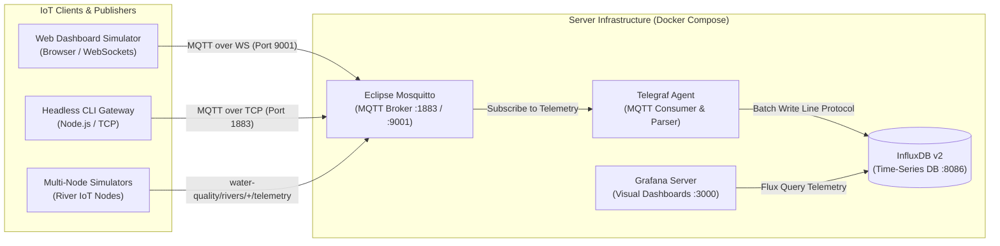

# HydroSense IoT - Water Quality Monitoring System

A mock application for river water quality monitoring measuring **Oxygen Saturation (% Saturation & mg/L)**, water temperature, and pH, automatically publishing readings to a central server/broker over **MQTT**.

---

## Core Technologies & Concepts Explained

This project brings together standard Internet of Things (IoT) protocols, ingestion pipelines, time-series storage, and visualization platforms:



### 1. MQTT (Message Queuing Telemetry Transport)
**MQTT** is an OASIS/ISO standard (ISO/IEC 20922) extremely lightweight, publish-subscribe network protocol designed for constrained devices, low-bandwidth environments, and high-latency or unreliable networks:
- **Publish / Subscribe Model**: Rather than traditional client-server communication (like HTTP request/response), MQTT decouples senders (**Publishers**) from receivers (**Subscribers**). Clients send data to specific hierarchical topics without knowing which clients (if any) are listening.
- **Topic Hierarchies**: Messages are published to string-based topic paths delimited by slashes (`/`), such as `water-quality/rivers/thames-01/telemetry`. Subscribers can listen to exact topics or use wildcards (`+` for single-level, `#` for multi-level).
- **Quality of Service (QoS)**:
  - `QoS 0` (At most once / "Fire and forget"): Messages are sent without acknowledgment (lowest overhead).
  - `QoS 1` (At least once): Messages are guaranteed to arrive, but duplicates may occur.
  - `QoS 2` (Exactly once): Guarantees delivery with no duplication (highest overhead).
- **Last Will and Testament (LWT)**: When a client connects, it registers an LWT message (e.g., `OFFLINE`) with the broker. If the client disconnects ungracefully (loss of power or connection), the broker publishes the LWT message on behalf of the client to notify subscribers.

---

### 2. MQTT Broker
An **MQTT Broker** is the central server and intelligence hub of any MQTT network:
- **Message Routing & Filtering**: Receives all published messages, filters them by topic, and dispatches them exclusively to clients that subscribed to matching topic filters.
- **Architectural Decoupling**:
  - *Space Decoupling*: Publishers and subscribers do not need to know each other's IP addresses, hostnames, or physical locations.
  - *Time Decoupling*: Publishers and subscribers do not need to run concurrently (especially when retained messages or persistent sessions are used).
  - *Synchronization Decoupling*: Publishing and consuming operations are asynchronous and do not block the execution of edge sensor microcontrollers or clients.
- **Session & State Management**: Maintains client connections, validates credentials/access control, manages message queues for disconnected clients with persistent sessions, and delivers retained messages to new subscribers.

---

### 3. Eclipse Mosquitto
**Eclipse Mosquitto** is an open-source (EPL/EDL licensed) message broker that implements MQTT versions 5.0, 3.1.1, and 3.1:
- **Lightweight & High-Performance**: Written in C, Mosquitto has a minimal memory footprint (~few MBs), making it suitable for everything from edge microcontrollers (like Raspberry Pi) to enterprise container clusters.
- **Dual Transport in this Project**:
  - **Standard TCP (`Port 1883`)**: Used by edge devices, hardware sensors, and the headless Node.js CLI clients.
  - **WebSockets (`Port 9001`)**: Bridges MQTT over HTTP/WebSocket frames, enabling native browser applications (like our web dashboard) to publish and subscribe directly from pure JavaScript without native socket permissions.

---

### 4. Telegraf (InfluxData)
**Telegraf** is an open-source, plugin-driven server agent developed by InfluxData for collecting, processing, aggregating, and writing telemetry data:
- **Role in the Ingestion Pipeline**: Serves as the bridge between the real-time MQTT message stream and the persistent time-series database.
- **Key Plugins Configured in this Project**:
  - `inputs.mqtt_consumer`: Connects to Mosquitto as a persistent subscriber listening to `water-quality/rivers/+/telemetry`. It ingests JSON-formatted payloads, extracts field metrics (`oxygenSaturationPct`, `dissolvedOxygenMgl`, `waterTempC`, `ph`, `batteryPct`), and captures device/river metadata as indexed tags.
  - `outputs.influxdb_v2`: Formats metrics into InfluxDB Line Protocol and writes them in efficient batches over HTTP into the InfluxDB storage engine.

---

### 5. InfluxDB (Time-Series Database)
**InfluxDB** is a database engine purpose-built for handling time-series data (measurements indexed and ordered by time):
- **Optimized for High Write Throughput**: Efficiently stores high-frequency sensor streams with automatic time-based partitioning and compression algorithms (e.g., Gorilla and Snappy compression).
- **Data Retention & Aggregation**: Enables retention policies to automatically expire old telemetry or downsample historical readings over time.
- **Flux & InfluxQL Engine**: Powers analytical queries and time-window aggregations across river metrics.

---

### 6. Grafana
**Grafana** is an open-source analytics, metric querying, and interactive visualization suite:
- **Real-Time Dashboards**: Connects to data sources like InfluxDB to query time-series data and render interactive panels, including:
  - Oxygen Saturation percentage dials and gauges with color-coded thresholds (Hypoxia warning < 50%, Normal 80–110%, Supersaturated > 110%).
  - Dissolved Oxygen (mg/L) historical trendlines.
  - Water temperature and pH correlation charts.
  - Battery levels and node connectivity status.
- **Automated Provisioning**: Configured with declarative YAML files (`provisioning/datasources` and `provisioning/dashboards`) so that both the InfluxDB connection and the River Monitoring Dashboard load automatically without manual UI setup upon container startup.

---

## Project Architecture & Directory Structure

The repository is structured to cleanly separate the **Server (MQTT Broker + Grafana Stack)** from the **Client applications** (Web Dashboard & Headless Node.js CLI):

```
mqqt-client/
├── server/                             # Server Stack (MQTT + InfluxDB + Grafana)
│   ├── docker-compose.yml              # Complete stack (Mosquitto, InfluxDB, Telegraf, Grafana)
│   ├── mosquitto.conf                  # Mosquitto Broker config (TCP 1883 & WebSockets 9001)
│   ├── telegraf/                       # Telegraf MQTT Ingest config
│   │   └── telegraf.conf
│   └── grafana/                        # Automated Grafana Provisioning
│       └── provisioning/
│           ├── datasources/            # Auto-provisioned InfluxDB datasource
│           └── dashboards/             # Auto-loaded River Monitoring Dashboard
│
├── client/
│   ├── web/                            # Web Client (Browser Dashboard & Simulator)
│   │   ├── index.html                  # HTML5 UI with broker presets & interval selector
│   │   ├── style.css                   # Glassmorphism dark mode design system
│   │   └── app.js                      # Oxygen saturation model & WebSocket MQTT client
│   │
│   └── node/                           # Headless Node.js CLI Client (Edge Gateway)
│       ├── package.json
│       └── index.js                    # Node.js MQTT publisher script
│
├── index.html                          # Root redirect to client/web/index.html
└── README.md                           # Documentation & Operating Instructions
```

---

## 1. Server Stack Setup (Mosquitto + InfluxDB + Grafana)

The server stack runs fully containerized via Docker Compose. It provisions:
- **Mosquitto MQTT Broker**: Port `1883` (TCP) & Port `9001` (WebSockets)
- **InfluxDB v2**: Port `8086` (Time-series telemetry database)
- **Telegraf**: Auto-subscribes to MQTT telemetry and writes to InfluxDB
- **Grafana Server**: Port `3000` (Pre-configured visual dashboard)

### Start Server Stack:
```bash
cd server
docker compose up -d
```

### Access Grafana Dashboard:
1. Open **`http://localhost:3000`** in your browser.
2. Log in with default credentials:
   - **Username**: `admin`
   - **Password**: `admin`
3. The **"River Water Quality Monitoring Dashboard"** will load automatically with pre-built Oxygen Saturation gauges, Dissolved Oxygen (mg/L) graphs, temperature/pH trendlines, and Hypoxia alert threshold indicators.

To stop the server stack:
```bash
cd server
docker compose down
```

---

## 2. How to Switch Between Brokers

### In the Web Client (`client/web/index.html`)
1. Open `client/web/index.html` in your browser.
2. In the top **MQTT Broker Target & Connection Settings** drawer, use the **Broker Target Preset** dropdown:
   - Select **Local Mosquitto Docker (`ws://localhost:9001`)** for local testing.
   - Select **Public EMQX Broker (`wss://broker.emqx.io:8084/mqtt`)** for public testing.
3. Click **"Connect to Broker"**.

### In the Headless Node.js Client (`client/node/index.js`)

You can switch brokers using CLI flags or environment variables:

```bash
cd client/node

# 1. Connect to Local Docker Mosquitto (Default: mqtt://localhost:1883)
node index.js

# 2. Connect to Public EMQX Broker using CLI flag
node index.js --broker emqx

# 3. Connect to Public EMQX Broker using Environment Variable
BROKER=emqx node index.js

# 4. Connect to a custom broker address
BROKER=mqtt://my-custom-broker.org:1883 node index.js
```

---

## 3. How to Increase or Change Publish Intervals

By default, production devices publish every **1 hour (3600 seconds)**. You can change this interval to faster test modes or longer schedules:

### In the Web Client (`client/web/index.html`)
1. In the left panel under **IoT Sensor Node & Schedule Controls**, locate **Publish Frequency / Interval**.
2. Select an interval preset:
   - **1 Hour (3600s)** (Standard production setting)
   - **15 Minutes (900s)**
   - **1 Minute (60s)**
   - **10 Seconds (10s)**
   - **5 Seconds** (Fast Test Mode)
   - **Custom...** (Specify any interval in seconds)

### In the Headless Node.js Client (`client/node/index.js`)

Pass the interval (in seconds) via CLI flag or environment variable:

```bash
cd client/node

# 1. Default Hourly Interval (3600 seconds)
node index.js

# 2. Fast Test Mode: Publish every 5 seconds using CLI flag
node index.js --interval 5

# 3. Publish every 15 minutes (900 seconds)
node index.js --interval 900

# 4. Combine Broker switch and custom interval:
node index.js --broker emqx --interval 10
```

---

## 4. Launching Multiple ($N$) Headless IoT Clients Simultaneously

To test central server ingestion with $N$ simulated IoT river monitoring nodes running in parallel:

### Option A: Using the Multi-Node Simulator Script (Recommended)
Pass `[numNodes]` and `[intervalSecs]`:

```bash
cd client/node

# Spawn 5 simulated river nodes publishing every 2 seconds
node simulate-nodes.js 5 2

# Spawn 10 simulated river nodes publishing every 5 seconds to local broker
node simulate-nodes.js 10 5

# Spawn 10 nodes connecting to public EMQX broker
BROKER=emqx node simulate-nodes.js 10 5
```
Press **`Ctrl + C`** at any time to gracefully terminate all simulated nodes.

### Option B: Terminal One-Liner (Bash `for` Loop)
Run multiple node instances directly in background processes:

```bash
# Launch 4 nodes (Thames, Severn, Trent, Mersey) publishing every 5s
for river in thames-01 severn-02 trent-03 mersey-04; do
  RIVER_ID=$river INTERVAL_SECS=5 node client/node/index.js &
done

# Stop all background node processes
pkill -f "node client/node/index.js"
```

---

## 5. MQTT Topics Summary

| Topic Pattern | Direction | Description |
|---|---|---|
| `water-quality/rivers/{river_id}/telemetry` | Publish | Periodic telemetry payload (Oxygen %, DO mg/L, Temp °C, pH, Battery) |
| `water-quality/rivers/{river_id}/alerts` | Publish | Critical alert sent when Oxygen Saturation drops below 50% |
| `water-quality/rivers/{river_id}/status` | Publish (LWT) | Last Will & Testament (`ONLINE` / `OFFLINE` device status) |

---

## 6. Sample Telemetry JSON Payload

```json
{
  "deviceId": "THAMES-O2-NODE1",
  "riverId": "thames-01",
  "riverName": "River Thames (London Node #1)",
  "location": {
    "latitude": 51.5074,
    "longitude": -0.1278
  },
  "telemetry": {
    "oxygenSaturationPct": 86.4,
    "dissolvedOxygenMgl": 8.92,
    "waterTempC": 14.8,
    "ph": 7.42
  },
  "status": {
    "batteryPct": 98,
    "hypoxiaWarning": false
  },
  "timestamp": "2026-07-30T17:08:00.000Z"
}
```
